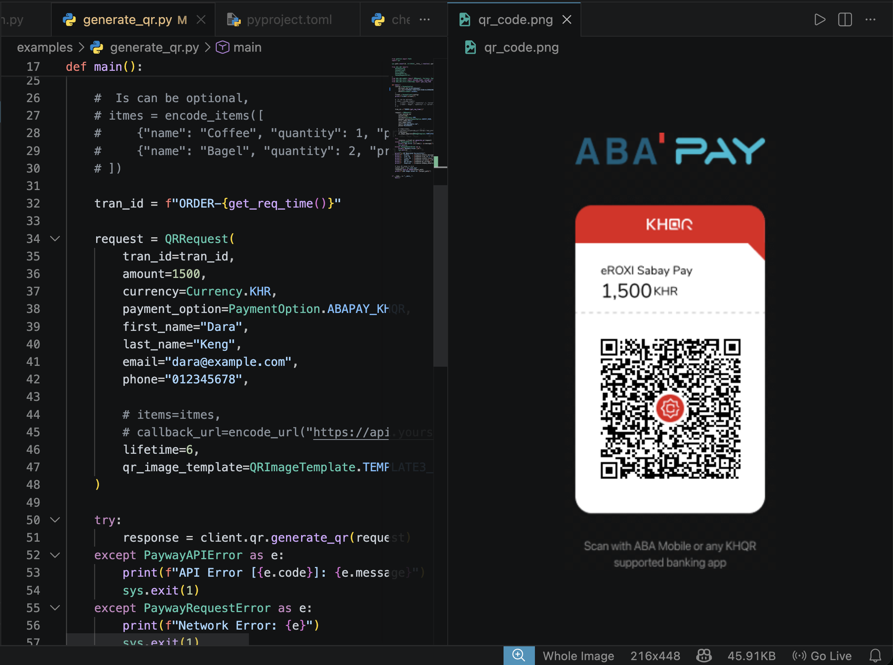

# ABA Payway Python SDK

A clean, dependency-free Python SDK for the [ABA PayWay](https://developer.payway.com.kh/) payment gateway.

> **Python 3.10+** · No third-party dependencies · Stdlib only

---

## Image Preview

<td></td>


---

## Quick Start

### 1. Install

```bash
pip install aba-payway
```

### 2. Configure

```python
from aba_sdk import PayWayClient, PayWayConfig, Environment

config = PayWayConfig(
    merchant_id="your_merchant_id",
    api_key="your_api_key",
    env=Environment.sandbox,   # OR Environment.production
)
client = PayWayClient(config)
```

### 3. Generate a QR Code

```python
from aba_sdk.models import QRRequest, Currency, PaymentOption
from aba_sdk.utils import encode_items, encode_url
from aba_sdk.utils.timestamp import get_req_time


request = QRRequest(
    tran_id=tran_id = f"ORDER-{get_req_time()}",
    amount=8.00,
    currency=Currency.USD,      # Supported KHR, USD
    payment_option=PaymentOption.ABAPAY_KHQR,
    first_name="Khon",
    last_name="Chanphearaa",
    email="phearaa@example.com",
    phone="012345678",

    # Optional
    items=encode_items([
        {"name": "Coffee", "quantity": 2, "price": 2.50},
        {"name": "Sandwich", "quantity": 1, "price": 3.00},
    ]),
    callback_url=encode_url("https://yoursite.com/payway/callback"),
    lifetime=6,
)

response = client.qr.generate_qr(request)

print(response.qr_string)           # Raw KHQR string
print(response.abapay_deeplink)     # Deep link for ABA Mobile
response.save_qr_image("qr.png")    # Save Base64 PNG to disk
```

---

## Error Handling

```python
from aba_sdk import PayWayAPIError, PayWayRequestError

try:
    response = client.qr.generate_qr(request)
except PayWayAPIError as e:

    # API returned an error (wrong domain, invalid hash, etc.)
    print(f"[{e.code}] {e.message}  trace={e.trace_id}")
except PayWayRequestError as e:

    # Network timeout or connection error
    print(f"Network error: {e}")
```

---

## Enums Reference

### Currency
| Value | Constant |
|-------|----------|
| `USD` | `Currency.USD` |
| `KHR` | `Currency.KHR` |

### PaymentOption
| Value | Constant | Notes |
|-------|----------|-------|
| `abapay` | `PaymentOption.ABAPAY` | |
| `khqr` | `PaymentOption.KHQR` | |
| `abapay_khqr` | `PaymentOption.ABAPAY_KHQR` | Most common |
| `wechat` | `PaymentOption.WECHAT` | USD only |
| `alipay` | `PaymentOption.ALIPAY` | USD only |
| `abapay_khqr_wechat_alipay` | `PaymentOption.ALL` | USD only |

### QRImageTemplate
`TEMPLATE1`, `TEMPLATE1_COLOR`, `TEMPLATE2`, `TEMPLATE2_COLOR`, `TEMPLATE3`, `TEMPLATE3_COLOR`

---

## Extending the SDK

Each API group gets its own file in `aba_sdk/api/` and its own models in `aba_sdk/models/`.
Then register the new client in `PayWayClient`:

```python
# aba_sdk/client.py
from .api.checkout import CheckoutClient   # new module

class PayWayClient:
    def __init__(self, config):
        self.qr = QRClient(config)
        self.checkout = CheckoutClient(config)   # add here
```

---

## Scope Project Feature

- [x] Generate QRCode
- [x] Check Transaction
- [x] Close Transaction


---

## Example How to Usages

Folder /examples

```bash
Run Python File
```

---

## Environments

| Environment | Base URL |
|-------------|----------|
| Sandbox | `https://checkout-sandbox.payway.com.kh` |
| Production | `https://checkout.payway.com.kh` |

> **Note:** Your IP/domain must be whitelisted by PayWay before production calls work.
> Contact `paywaysales@ababank.com` for production credentials.